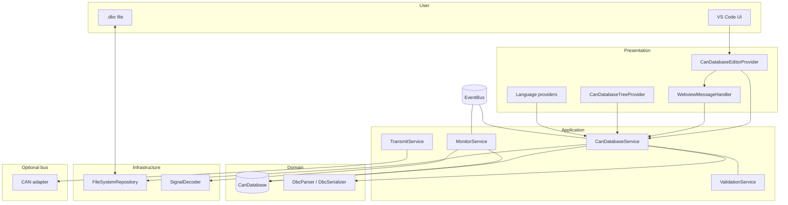
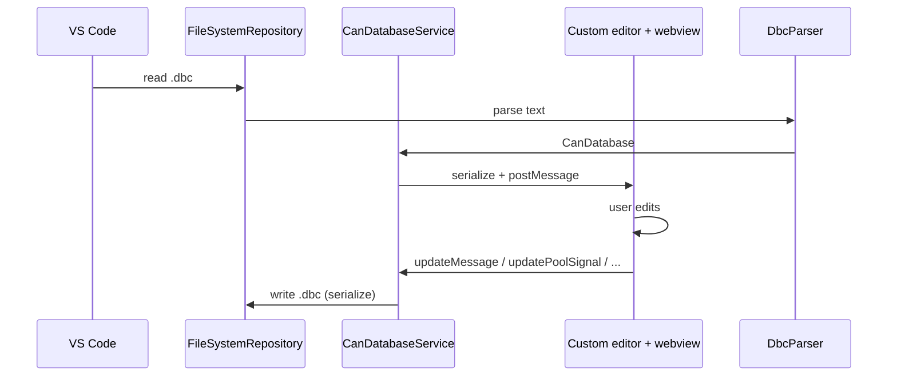
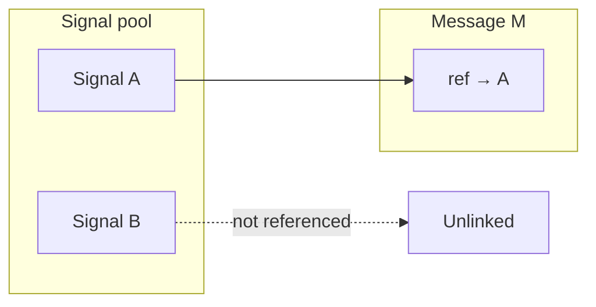

# CAN Studio architecture

High-level view of how the **can-studio** extension is structured: **persistence**, **domain**, **application services**, **presentation** (custom editor, webview, tree, language features), and **optional hardware** (monitor / transmit).

**Step-by-step extension-host guide (layered, with diagrams):** see [architecture/README.md](architecture/README.md) — start with [architecture/01-overview.md](architecture/01-overview.md).

## Layered overview

- **CanDatabase** is the in-memory aggregate: nodes, messages, global **signal pool**, value tables, attributes, etc.
- **CanDatabaseService** loads/saves `.dbc`, applies edits from the webview, and emits **database:loaded** / **database:changed** on the **EventBus**.
- **Custom editor** hosts a **Svelte webview** for structured editing; the same database is shown in the **sidebar tree** and used by **hover / completion / diagnostics** where applicable.
- **MonitorService** / **TransmitService** are wired only after a **bus adapter** connects; they use **SignalDecoder** and the current database for decode (and future encode paths).

### Virtual CAN simulation (spec 010)

**VirtualBusSimulationService** (application layer) owns virtual session state and DBC-aligned injection. It drives **`VirtualCanAdapter.injectFrameForMonitor`**, which pushes `CanFrame` instances into the same `onFrameReceived` path **MonitorService** already subscribes to—so decode, **EventBus** (`bus:messageDecoded`), and Signal Lab charts match hardware traffic. Signal Lab sends **`virtualBus.start` / `virtualBus.stop` / `virtualBus.inject`** via **`WebviewMessageHandler`**; **`ConnectBusCommand`** may attach a fresh virtual adapter or reuse one from **Connect Bus → Virtual**, and gates switching between hardware and virtual when simulation is running. Periodic virtual traffic reuses **`transmit.startPeriodic`** webview messages but routes ticks to injection instead of **`TransmitService.send`** when `connectionMode` is `virtual_simulation`.

## Data flow: open and edit a database

## Signal pool vs message frames

DBC signals are stored in a **global pool** (unique names). Each **message** references pool signals by name with per-frame placement (start bit, endianness, etc.). Signals that exist only in the pool and are **not linked to any message** are **unlinked** (sometimes called dangling): they round-trip in a DBC extension block until assigned or removed.

The **CAN Database** sidebar tree lists **Unlinked signals** separately, with a warning affordance so they are easy to spot.

## Where to look in the repo

| Area | Typical location |
|------|------------------|
| Domain models | `src/core/models/database/` |
| DBC parse/serialize | `src/infrastructure/parsers/dbc/` |
| Load/save, edits | `src/application/services/CanDatabaseService.ts` |
| Webview protocol + serialization | `src/presentation/webview/` |
| Custom editor | `src/presentation/editors/CanDatabaseEditorProvider.ts` |
| Sidebar tree | `src/presentation/views/treeview/` |
| Webview UI | `webview-ui/src/` |
| Signal Lab webview | `webview-ui/signal-lab.html`, `SignalLabApp.svelte` |

In the **DBC custom editor**, the **Architecture** tab (`ArchitectureView.svelte`) shows the same layered extension overview plus a **live network map**: every **BU_** node from the loaded file, with messages grouped by **transmitter**, plus frames whose transmitter is missing or not in the node list.

## Signal Lab (singleton webview)

**Signal Lab** is the instrumentation surface: live frames, decoded signals, and transmit. It is separate from the **CAN Database Editor** webview, which is for authoring the DBC (messages, signals, nodes, value tables, attributes). One Signal Lab panel is opened via the status bar or Command Palette; a second invocation reveals the existing panel.

**Active database for the bus**: `CanDatabaseService` tracks which loaded session (`TextDocument` URI) decodes traffic and fills the transmit message list. The user selects this in Signal Lab; `MonitorService` uses `getDatabaseForBus()` after connect and when the active URI changes.

Bus traffic is posted to the Signal Lab webview only (not broadcast to every custom editor), to avoid duplicate work when multiple `.dbc` tabs are open.

### Signal Lab graphs

Charts are implemented in the **Signal Lab** webview **Charts** tab:

- **Data**: The same decoded traffic as Monitor (`monitor.frame` → `DecodedFrameDescriptor`). The webview keeps **ring buffers per selected signal** (Unix ms on X, physical value on Y), keyed by `${frameId}:${signalName}`, with a **fixed cap** per series (`MAX_CHART_POINTS` in `signalChartStore`) so memory stays bounded. Ingestion runs only for **checked** signals (not for every decoded field).
- **UI throttle**: Chart redraws are driven by a **revision counter** throttled to ~**20 Hz** (50 ms interval), not on every frame, so the UI stays smooth under high bus rates.
- **Library**: **[uPlot](https://github.com/leeoniya/uPlot)** (canvas, small bundle) in the Signal Lab build; CSS is pulled in via `signal-lab-main.ts`. One uPlot instance per selected signal (stacked cards).
- **Tab visibility**: When the **Charts** tab is not active, **append to ring buffers is paused** to save CPU on high-rate traffic; switching back shows new data only after frames arrive again.
- **Optional later**: If profiling shows pressure, aggregate samples in `MonitorService` before sending to the webview.

Diagrams in this file use [Mermaid](https://mermaid.js.org/); they render on GitHub and in many Markdown preview tools.
